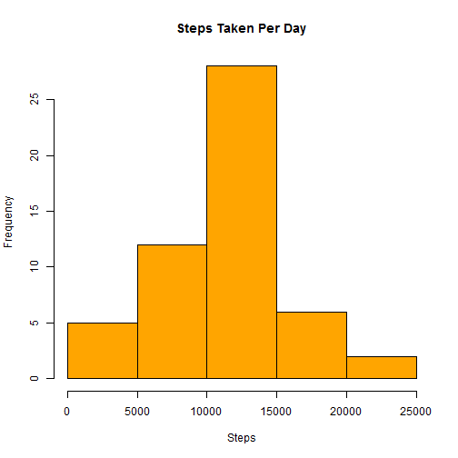
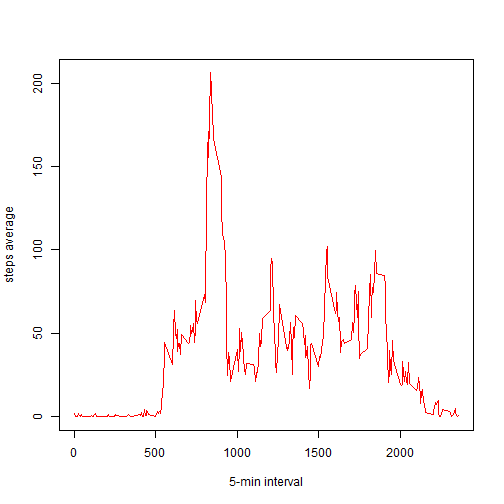
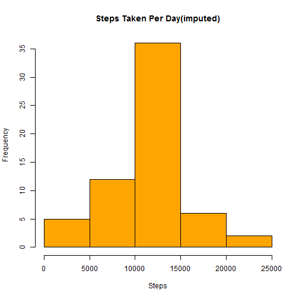
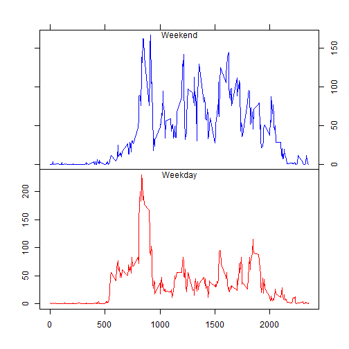

Reproducible Research: Peer Assignment 1
==========================================

All details including the data source and description of this project can be found from [Course Project 1](https://www.coursera.org/learn/reproducible-research/peer/gYyPt/course-project-1).

## Loading and preprocessing the data
We first download the [activity monitoring data](https://d396qusza40orc.cloudfront.net/repdata%2Fdata%2Factivity.zip).


```r
if(!file.exists("repdata%2Fdata%2Factivity.zip")){
      temp <- tempfile()
      download.file("https://d396qusza40orc.cloudfront.net/repdata%2Fdata%2Factivity.zip",temp)
      file <- unzip(temp)
      unlink(temp)
}
```

Now read the file("activity.csv") and take a summary of the data.

```r
data <- read.csv("activity.csv",na.strings="NA",stringsAsFactors=F)
str(data)
```

```
## 'data.frame':	17568 obs. of  3 variables:
##  $ steps   : int  NA NA NA NA NA NA NA NA NA NA ...
##  $ date    : chr  "2012-10-01" "2012-10-01" "2012-10-01" "2012-10-01" ...
##  $ interval: int  0 5 10 15 20 25 30 35 40 45 ...
```


Convert the date (**characters**) to **date** format.

```r
data$date <- as.Date(data$date,"%Y-%m-%d")
class(data$date)
```

```
## [1] "Date"
```
Now as you see the class of date is *Date*.


## what is mean total number of steps taken per day?

(*For this part of the assignment, we ignore the missing values in the dataset.*)

Calculate the total number of steps taken per day:

```r
stepsPerDay <- sapply(split(data$steps,data$date),sum)
```

Make a histogram of the total number of steps taken each day:

```r
hist(stepsPerDay,col="orange",xlab="Steps",main="Steps Taken Per Day") 
```



Calculate and report the mean and median of the total number of steps taken per day:

```r
mean(stepsPerDay,na.rm = T) 
```

```
## [1] 10766.19
```

```r
median(stepsPerDay,na.rm = T)
```

```
## [1] 10765
```


## What is the average daily activity pattern?

Calculate the average number of steps taken, averaged across all days, for each 5-minute interval:


```r
intervalAvgSteps <- tapply(data$steps,data$interval,mean,na.rm=T)
```
Make a time series plot:


```r
plot(row.names(intervalAvgSteps),intervalAvgSteps,type="l",xlab="5-min interval",ylab="steps average",col="red")
```



Which 5-minute interval, on average across all the days in the dataset, contains the maximum number of steps?

```r
which.max(intervalAvgSteps)
```

```
## 835 
## 104
```
So the interval number 835 (104th element in all interval) gives maximum number of steps.

## Imputing missing values
Calculate and report the total number of missing values in the dataset:


```r
sum(is.na(data$steps))
```

```
## [1] 2304
```

Now fill in all of the missing values in the dataset. All NAs appear in the column *steps*, we use the mean for that 5-minute interval to fill. Create a new dataset that is equal to the original dataset but with the missing data filled in.


```r
newdata <- data
for (i in 1:nrow(newdata)){
    if(is.na(newdata$steps[i])) {newdata$steps[i] <- mean(newdata$steps[newdata$interval==newdata[i,]$interval], na.rm=T)}
    
}
```
Make a histogram of the total number of steps taken each day and Calculate and report the mean and median total number of steps taken per day.

```r
stepsPerDay2 <- sapply(split(newdata$steps,newdata$date),sum)

hist(stepsPerDay2,col="orange",xlab="Steps",main="Steps Taken Per Day(imputed)") # histogram total steps taken per day
```



```r
mean(stepsPerDay2) 
```

```
## [1] 10766.19
```

```r
median(stepsPerDay2)
```

```
## [1] 10766.19
```
Notice these values differ from the estimates from the first part of the assignment. After imputing, the mean and median of steps taken per day are equal.


## Are there differences in activity patterns between weekdays and weekends?

*Use the dataset(**newdata**) with the filled-in missing values for this part.*

Create a new factor variable in the dataset with two levels – “weekday” and “weekend” indicating whether a given date is a weekday or weekend day.


```r
days <-ifelse(weekdays(newdata$date) %in% c("Saturday","Sunday"),"weekend","weekday")
days <- as.factor(days)
newdata <- cbind(newdata,days)
```
Make a panel plot containing a time series plot of the 5-minute interval (x-axis) and the average number of steps taken, averaged across all weekday days or weekend days (y-axis). 

```r
weekendAvg <- with(subset(newdata,newdata$days=="weekend"),tapply(steps,interval,mean))

weekdayAvg <- with(subset(newdata,newdata$days=="weekday"),tapply(steps,interval,mean))

par(mfrow = c(2, 1),mar=rep(0,4), oma = c(4,4,3,3))

plot(row.names(weekendAvg),weekendAvg,type="l",xlab="",ylab="",main="",col="blue",axes=F)
mtext("Weekend",side=3,line=-1)
box(); axis(2, labels=FALSE); axis(3, labels=FALSE); axis(4)

plot(row.names(weekdayAvg),weekdayAvg,type="l",xlab="Interval",ylab="",main="",col="red",axes=F)
mtext("Weekday",side=3,line=-1)
box(); axis(1); axis(2);
```




